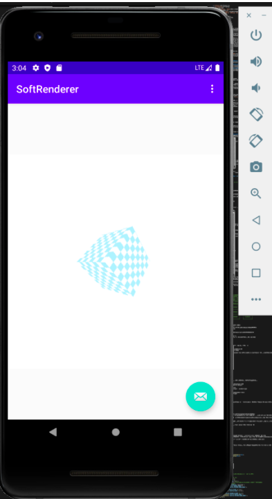
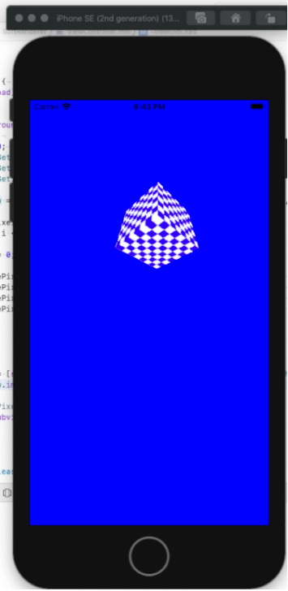
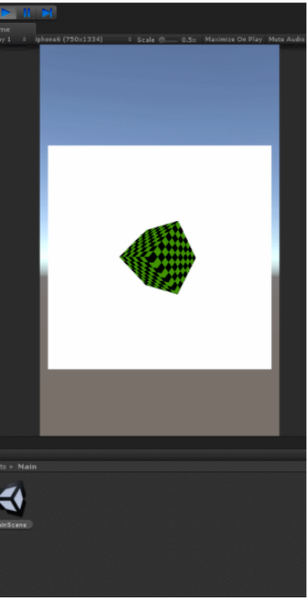
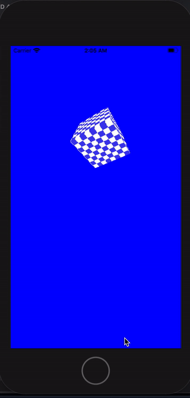

# SoftRenderer

   

软光栅讨论 视频录制：https://www.bilibili.com/video/BV1B44y1j7mK

Android、iOS、Unity、Unreal都可以运行，不使用任何图形库接口，纯代码来实现渲染管线，比起学习Opengl等更好的理解渲染管线，代码中都有详细注解。（觉得有趣麻烦给个star）
---

|平台|语言|工程路径|效果|
|-|-|-|-|
| | |https://github.com/wlxklyh/SoftRenderer/tree/master/Ado||
| | |https://github.com/wlxklyh/SoftRenderer/tree/master/iOS||
| | |https://github.com/wlxklyh/SoftRenderer/tree/master/Unity||
| | |https://github.com/wlxklyh/SoftRenderer/tree/master/Unreal||




## 前言
程序员的三大浪漫，编译原理、图形学、操作系统，所以我也有一种情节，想去学图形学。然后我拿起图形学的书，看完了第一章 似懂非懂，然后书又沾灰了。过了一段时间工作上遇到渲染管线相关的问题，然后又开始去网上看博客，看完之后也是似懂非懂，你是否也有跟我一样的经历了？Opengl的接口背后是什么呢？渲染管线怎么用程序表达。于是我找到一个skywind3000的软渲染器，然后自己再实现一遍，这样之后对渲染管线的理解更加深刻了。

通过代码来了解渲染管线 不调用图形库，ado、ios、unity、unreal都可以运行 

## 一、渲染管线

### 渲染管线流程图
```cpp
/*
 *  1、最简单的渲染流水线:
 *       分成CPU阶段和GPU阶段
 *      +--------------+     +-------------+
 *      |              |     |             |
 *      |     CPU      +----->     GPU     |
 *      |              |     |             |
 *      +--------------+     +-------------+
 *
 *  2、其中CPU阶段就是应用阶段  GPU阶段包括了几何阶段和光栅化阶段
 *      +--------------+     +-----------------+  +----------------+   +----------------+
 *      |              |     |                 |  |                |   |                |
 *      |   应用阶段    +----->     几何阶段      +-->      光栅化     +--->     像素处理     |
 *      |              |     |                 |  |                |   |                |
 *      +--------------+     +-----------------+  +----------------+   +----------------+
 *
 *  3、几何阶段：
 *      +--------------+     +-----------------+  +------------------+   +-------------+  +-------------+
 *      |              |     |                 |  |                  |   |             |  |             |
 *      |  顶点着色器    +----->  曲面细分着色器    +-->     几何着色器     +--->    裁剪     |-->    屏幕投射  |
 *      |              |     |                 |  |                  |   |             |  |             |
 *      +--------------+     +-----------------+  +------------------+   +-------------+  +-------------+
 *
 *  4、光栅化阶段：
 *      +--------------+     +--------------+  +------------------+
 *      |              |     |              |  |                  |
 *      |  三角形遍历    +----->  三角形设置    +-->     片元着色器    |
 *      |              |     |              |  |                  |
 *      +--------------+     +--------------+  +------------------+
 *
 *  5、像素处理阶段：
 *        深度测试ZTest
 *        颜色混合
 *      模板测试（模板缓冲）
 *
 ```
### 工程调用堆栈
```cpp
 *    【说明】：下面的代码根据上面的流水线来讲解和划分
 *    绘制调用堆栈：
 *        HScreenDevice::Draw
 *            HScreenDevice::ClearScreen                                     清屏
 *            HCube::Draw                                                    Cube绘制
 *                HCube::DrawBox                                             立方体绘制
 *                    HCube::DrawPlane                                       长方形绘制
 *                        HCube::DrawTriangle                                三角形绘制
 *
 *                            HCube::UpdateMVPMat()                            1、更新MVP矩阵                           -|
 *                            HCube::vert()                                    2、顶点着色器 之后就是裁剪空间坐标了           |
 *                                                                             3、曲面细分着色器 几何着色器【TODO】          |--->几何阶段
 *                            HCube::CheckTriangleInCVV()                      4、裁剪 检查在不在裁剪空间里面                |
 *                            HCube::CalTriangleScreenSpacePos()               5、屏幕投射                               -|
 *
 *                            HCube::InitTriangleInterpn()                     1、插值初始化 后面透视校正用               -|
 *                            Triangle::CalculateTrap() DrawTrap DrawScanline  2、三角形设置、三角形遍历 得到片元信息        |--->光栅化阶段
 *                            HCube::frag                                      3、片元着色器                            -|
 *
 *                            ZTest Zwrite
```

### 具体步骤（都有对应的代码）：
1. 一个立方体分解为画8个面：索引的知识  用索引节省内存 内存和显存
2. 一个面分解为2个三角形：每个三角形初始化的是模型空间的坐标
3. 一个三角形绘制前要更新MVP矩阵：
   1. Transform的旋转矩阵 等于X Y Z旋转矩阵乘法（用四元素效果更高）Transform的位移矩阵、缩放矩阵scale
   2. View矩阵：GetLookAtMat(camera相机位置,at相机看的位置,up)
      // Rx Ry Rz 0
      // Ux Uy Uz 0
      // Dx Dy Dz 0
      // 0  0  0  1 
   3. Projection矩阵：GetPerspectiveMat(fov,aspect宽高比,zn,zf)
4. 顶点着色器：顶点着色器返回的是裁剪空间的坐标
5. 裁剪 会拆分三角形 这个时候裁剪空间是 [-w,-w,-w] 到 [w,w,w]
6. 归一化 除以w 变成
7. 屏幕投射
8. 插值初始化 （特别是在纹理采样做透视校正使用 有深度透视的采样）
9. 光栅化的插值三角形设置之插值 
   1.  扫描拆分梯形 拆成0-2个梯形  扫描这两个梯形
   2.  包围盒方法 包围盒扫描，判断点是否在三角形中  
10. 扫描梯形方法 会得到扫描线 然后绘制扫描线
11. 绘制片元 逐像素过程：深度测试 这个时候要取出深度缓冲 和 framebuffer 同时也要写入
12. 片元绘制 会有片元着色器的过程
## 二、工程说明
### Ado
- 基本介绍：
用了ImageView来显示HScreenDevice的buffer，主要去看FirstFragment这个的代码。

- 如何打开工程：
用AndroudStudio打开

- 主代码：
具体看代码的注释：
https://github.com/wlxklyh/SoftRenderer/blob/master/Ado/app/src/main/java/com/wlxklyh/softrenderer/FirstFragment.java

### iOS
- 基本介绍：
用了UIImage来显示HScreenDevice的buffer，主要去看SoftRenderer.h这个的代码。

- 如何打开工程：
xcode打开工程

- 主代码：
具体看代码的注释：
https://github.com/wlxklyh/SoftRenderer/blob/master/iOS/SoftRenderer/SoftRenderer/SoftRenderer.h

### unity
- 基本介绍：
MainScene下面有个Canvas Canvas有个Image,MainCode.cs脚本每帧会调用软渲染器的Draw,然后把FrameBuffer数据取出来 调用Unity的Texture2D.SetPixel接口 然后用Image把这个Texture2d显示出来。

- 如何打开工程：
Unity打开工程 MainScene

- 主代码：
具体看代码的注释：
https://github.com/wlxklyh/SoftRenderer/blob/master/Unity/Assets/MainCode.cs

### Unreal
- 基本介绍：
UMainUICpp里面有个MainImage 每帧会把软渲染器的数据显示到MainImage中，除此之外，没使用Unreal的其他接口。

- 如何打开工程：
打开工程，打开MainUILevel关卡，然后运行就会如下显示

- 主代码
具体看代码的注释：
https://github.com/wlxklyh/SoftRenderer/blob/master/Unreal/Source/Graphic/SoftRenderer/ScreenDevice.h

## 三、TODO
后续要用C++跨平台。
- 三角形裁剪完善
- 几何着色器和片元着色器完善
- BRDF光照模型
- 模板测试


## 附
**目前可以加微信（wlxklyh）约时间语音讲解SoftRenderer（15分钟到1小时）**
**欢迎加微信讨论（备注Gituhb）**

